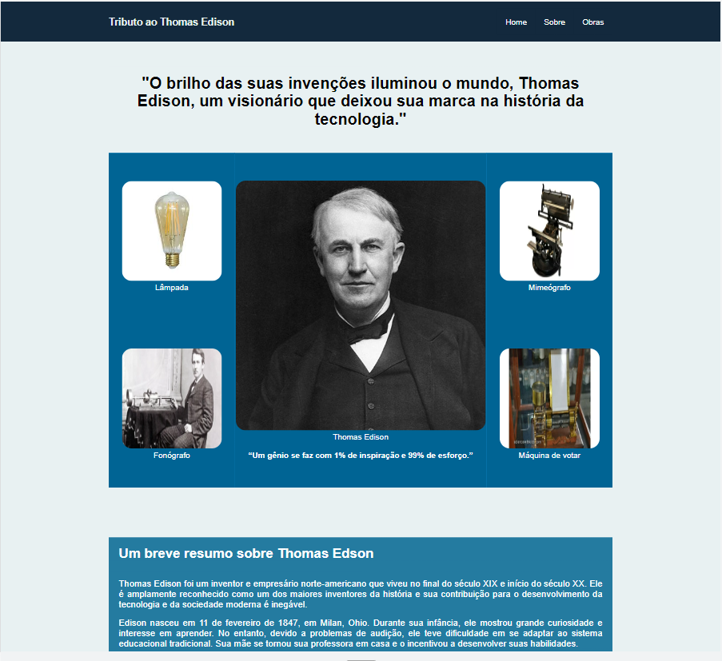
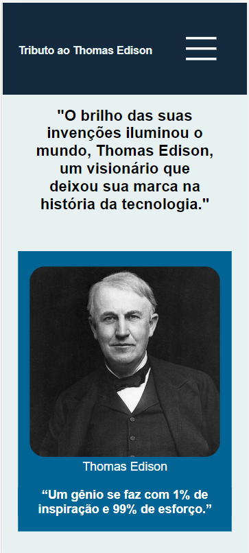

# site-tributo-thomas-edison
Este site foi feito com o intuito de praticar os conhecimento adquiridos em html e css tais como:
    <ul>
        <li> Uso do Flex box
        <li> Uso do @Media para deixar o site responsivo
    </ul>

## Demostração em Desktop

## Demostração Mobile

## Créditos
Desenvolvido por [Jeanderson Santos](https://github.com/JeandersonSantos)

Veja o site [clicando aqui](https://jeandersonsantos.github.io/site-tributo-thomas-edison/)

